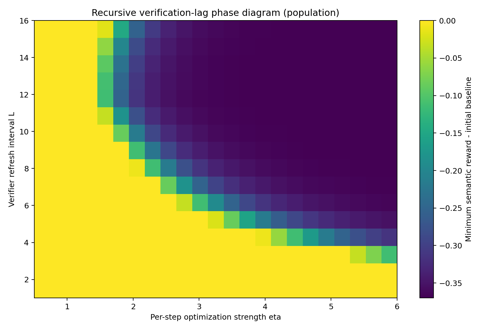
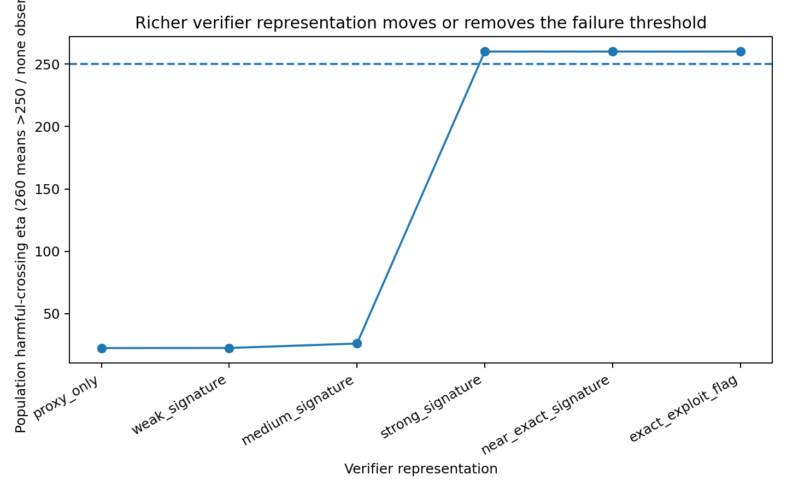
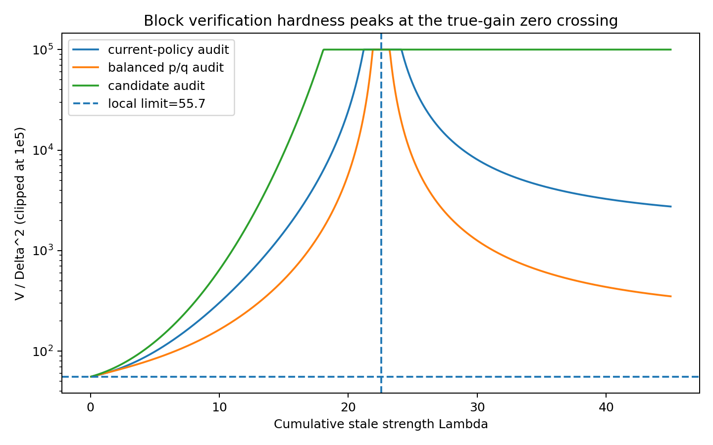

# Recursive Verification Lag

**When must verification catch up with a self-improving policy?**

This repository contains an independent research project on the statistical limits of recursively reusing imperfect verifiers during policy optimization.

The central question is:

> How much genuinely fresh trusted verification is needed to sustain recursive policy improvement when the policy adaptively optimizes an imperfect verifier?

The current answer is more nuanced than “verify every round.” The evidence in this repository supports the view that fresh verification is needed when optimization creates **statistically new or poorly covered policy comparisons faster than the verifier can generalize or refresh**.

## Main findings

### 1. Adaptive moving-tail verification can be expensive

In a worst-case adaptive family, current-policy auditing pays a factor proportional to candidate amplification. For equal amplification parameter `M` over `T` rounds, the fixed-budget high-probability complexity is

\[
B_{\mathrm{current}}^\star
=\Theta\!\left(TM\log\frac{T}{\delta}\right),
\]

while candidate-aware auditing reduces this to

\[
B_{\mathrm{candidate}}^\star
=\Theta\!\left(T\log\frac{T}{\delta}\right).
\]

This is a worst-case result, not a universal law. With structured verifier/reward classes, raw density-ratio amplification is replaced by a restricted coverage geometry.

### 2. Optimizing and certifying with the same learned verifier can be structurally blind

In a canonical linear plug-in model,

\[
\widehat\Delta
=\eta\|\widehat\theta\|_\Sigma^2\ge 0,
\]

so a naive same-verifier self-certificate has zero rejection power. This result is architecture-specific; it is not claimed for arbitrary verifiers.

### 3. Misspecification creates a stable optimization threshold, but recursive refresh changes the story

Across three controlled settings—non-Gaussian reward, finite program semantics, and a learned autoregressive DSL generator—the location of the semantic sign-reversal threshold is nearly invariant to a large change in trusted-data budget, while the transition width shrinks approximately as `n^(-1/2)`.

However, in a recursive loop, refitting the verifier on the current policy can self-correct. Failure then depends strongly on **verifier staleness**.

### 4. The right recursive unit is a composed policy comparison

If a verifier is frozen for `L` exponential updates,

\[
p_{s+L}(y)
\propto
p_s(y)\exp\!\left(\Lambda_s v_s(y)\right),
\qquad
\Lambda_s=\sum_{k=1}^L\eta_{s,k}.
\]

The entire stale block can therefore be viewed as one composed endpoint comparison `p_s -> q_{s:L}`.

For a structured reward/error class `F`, the block-end trusted-label complexity is

\[
m_s
=O\!\left(
\frac{\mathcal V_{\mathcal F_s}(p_s,q_{s:L};\mu_s)}{\Gamma_s^2}
\log\frac1{\delta_s}
\right),
\]

conditional on the endpoint candidate being fixed before the current certification batch is observed.

This leads to the working interpretation:

> **Verification lag is policy shift relative to verifier-error geometry, not elapsed time.**

## Representative empirical results

| Experiment | Main result |
|---|---|
| Finite non-Gaussian reward | threshold `eta* ~= 3.50`; width `~ n^-0.515` |
| Finite program synthesis | threshold `eta* ~= 24.61`; width `~ n^-0.525` |
| Learned autoregressive DSL generator | threshold `eta* ~= 22.54`; width `~ n^-0.531` |
| Verifier-representation ablation | richer representation moves or removes threshold |
| Best-of-N control | performance peaks around `N=6`, becomes harmful around `N=34` |
| Recursive refresh cadence | fast refresh self-corrects; stale reuse can collapse |
| 2D recursive phase | failure approximately collapses under stale exposure within a fixed score calibration |
| Invariance test | max log-density ratio transfers well across optimizer families, but no shift-only scalar works across verifier classes |

## Key figures

### Recursive verification-lag phase



### Verifier representation changes the failure boundary



### Composed-block verification hardness



## Repository structure

```text
recursive-verification-lag/
├── README.md
├── requirements.txt
├── PUBLISH_TO_GITHUB.md
├── docs/
│   ├── research_overview.md
│   ├── theory.md
│   ├── experiments.md
│   ├── corrections_and_negative_results.md
│   └── roadmap.md
├── notes/
│   ├── master_research_record.md
│   └── progress/
├── src/
│   ├── reproduce_key_figures.py
│   ├── summarize_results.py
│   └── composed_block_demo.py
├── data/
└── figures/
```

## Reproducing the archived plots

```bash
python -m venv .venv
source .venv/bin/activate  # Windows: .venv\\Scripts\\activate
pip install -r requirements.txt
python src/reproduce_key_figures.py
python src/summarize_results.py
```

The archived CSV files are the numerical outputs of the experiments run during this project. The plotting scripts reproduce selected figures from those outputs.

`src/composed_block_demo.py` is a standalone mathematical sanity-check for stale exponential-policy composition and the associated chi-square verification geometry.

## What is *not* claimed

This is a research project in progress. In particular:

- The real-model experiments use a small learned GRU/DSL generator, **not a pretrained frontier code LLM**.
- Numerical thresholds such as `eta* ~= 22.54` are environment-specific.
- There is no universal `eta * L`, KL, or density-ratio safety threshold.
- More trusted data do not inherently make a policy worse; in the misspecified self-certification experiments, more data make the fitted wrong model more statistically stable.
- A previously explored conjecture that two structurally distinct audit streams are necessary was **refuted**; a balanced single stream can serve both current certification and future training roles.
- Some supporting results are standard or standard-adjacent (restricted chi-square, reusable holdout machinery, confidence ellipsoids). The intended contribution is their recursive interaction with optimizer-induced coverage shift and verifier reuse.

## Research status

The project currently has a theorem/experiment bridge but is not presented here as a finished peer-reviewed result. The full research ledger records proof status, corrections, falsified conjectures, and open problems in detail:

- [`notes/master_research_record.md`](notes/master_research_record.md)

## Current next step

The highest-value external validation is a pretrained code-model experiment with:

1. multiple sampled candidate programs per task,
2. public tests as a cheap proxy,
3. hidden/exhaustive tests as trusted semantic reward,
4. independent sweeps over optimization pressure, verifier refresh cadence, and trusted-label budget,
5. a richer-verifier control,
6. comparison of stale-shift coordinates such as max density ratio, KL, and restricted feature geometry.

---

**Status:** active independent research, September 2026.
