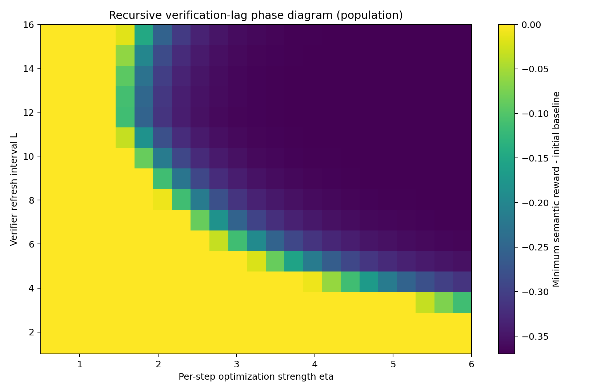
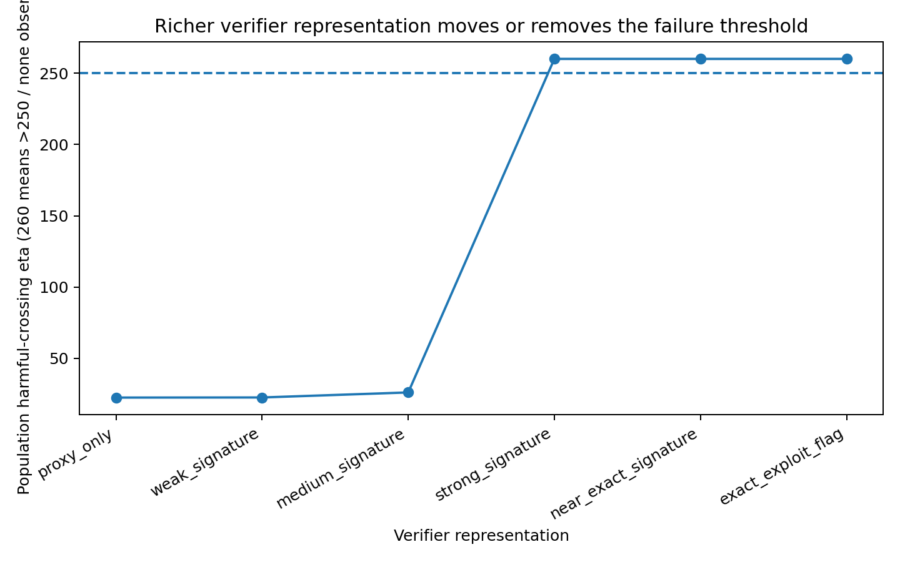
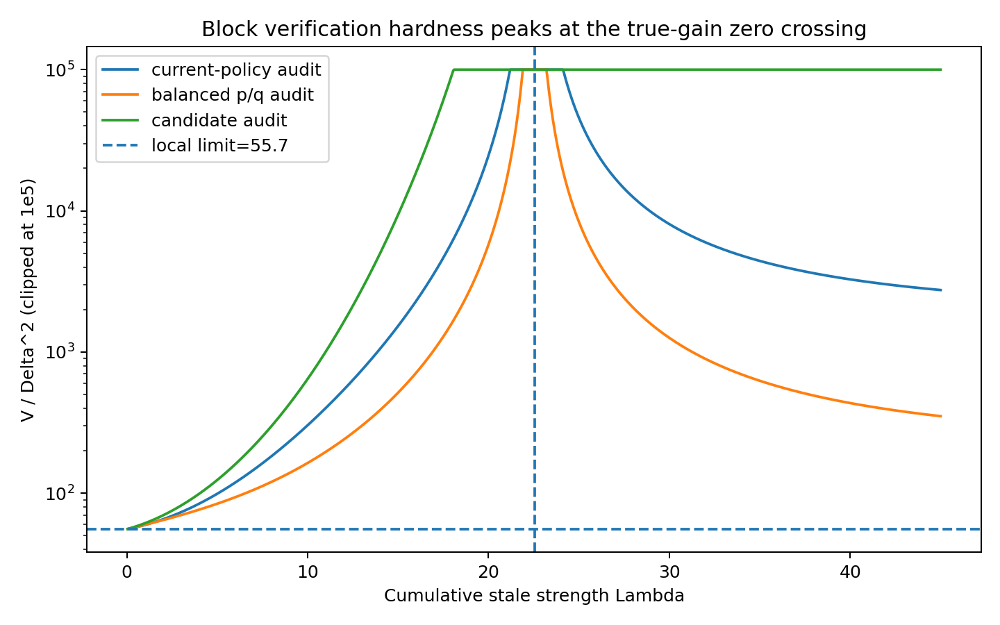

# Recursive Verification Lag

**When must verification catch up with a self-improving policy?**

This repository contains an independent research project on the statistical limits of recursively reusing imperfect verifiers during policy optimization.

## Executable asynchronous RVL lab

The new [mini-lab runbook](docs/mini_frontier_lab.md) connects persistent replay,
asynchronous actors/learner, real policy gradients, trusted verification,
learned residual critics, adversarial task search and reward re-evaluation.
It includes a dependency-free CPU/Mac reference, a real causal-LM path,
model-driven Python tool agents with external Docker grading, and a torchrun
token-replay learner. Features and GPU evidence boundaries are listed explicitly.

~~~bash
python -m src.run_mini_lab --output artifacts/async-lab --episodes 256 --actors 4
python -m src.benchmark_mini_lab --output artifacts/ablation --seeds 17,29,43 --episodes 256 --learning-rates 0.08,0.2 --cadences 2,8
~~~

Candidate updates are now transactional: the active policy and candidate are compared on the same held-out suite, promotion fails closed on configured regression criteria, rejected learner state is rolled back, and every decision is recorded in a tamper-evident hash chain.

CI runs Linux/macOS replay, recovery, numerical and integration tests; real
Transformers gradients; two-rank DDP RL; executable Docker rewards; and paired
adaptive/fixed/no-refresh comparisons. No 7B/30B capability or GPU scaling result
is claimed. The code supports configurable long-episode budgets; multi-hour
successful trajectories remain an unvalidated acceptance criterion.

## Verified RL systems engineering track

Alongside the RVL research, this repository contains a tested post-training
systems stack for verifiable-reward RL. The engineering path is deliberately
separated into lightweight CI checks, real-model checks, and GPU-scale
experiments that still require external hardware.

| Capability | Evidence |
|---|---|
| Real causal-LM RL path | Hugging Face model rollout -> verifier -> token-level clipped GRPO update in CI, plus held-out Qwen/GSM8K runner with optional per-step transactional promotion and optimizer/RNG rollback |
| Distributed training primitives | real CPU `torchrun` DDP CI plus GPU-ready NCCL/FSDP sharded checkpoint-resume and 1→2 GPU scaling acceptance |
| Rollout serving | bounded async rollout, EWMA + prefill/decode/KV-aware routing, weighted workload admission, fair multi-workload scheduling, overload shedding, end-to-end deadlines, optional hedged requests |
| Failure handling | cross-worker failover, circuit-breaker quarantine, single half-open recovery probes, loser cancellation, stale policy-version rejection |
| Remote workers | actual asyncio TCP RPC server/client with request IDs, ping, errors, and policy-version checks |
| Trainer/worker coordination | immutable weight manifests, SHA-256 integrity checks, monotonically increasing versions, worker acknowledgements, plus real-model NCCL policy-broadcast latency/bandwidth benchmark |
| Numerics | fp32 log-softmax, ratio clipping, non-finite guards, gradient checks, FP16/BF16 parity gates, real-GPU FP32/BF16/FP16 GRPO comparison, and INT8 weight-only numerical contracts |
| Kernel optimization | optional fused Triton tokenwise GRPO surrogate with custom backward, PyTorch forward/gradient parity benchmark, GPU speed harness |
| Observability | counters, tokens/s, p50/p95/max latency, Chrome traces, deterministic control-plane replay, machine-readable benchmark reports, and named real-GPU GRPO stage profiling |
| GPU serving integration | OpenAI-compatible vLLM/SGLang adapter, streaming TTFT/TBT benchmark, Prometheus metrics capture, GPU telemetry, real process-failure harness, and one-shot two-GPU evidence workflow |

Start with [the systems architecture](docs/rl_system_architecture.md), the
[engineering runbook](docs/xai_rl_systems.md), the
[SLO-aware scheduler design](docs/slo_scheduler.md),
[workload admission design](docs/admission_control.md),
[replay/regression design](docs/replay_and_regression.md),
[free-GPU runbook](docs/free_gpu_runbook.md),
[Triton GRPO kernel note](docs/triton_grpo.md),
[Qwen RLVR experiment](docs/qwen_rlvr_experiment.md),
[FSDP/NCCL acceptance](docs/fsdp_nccl_acceptance.md),
[one-shot GPU evidence bundle](docs/gpu_evidence_bundle.md), and the
[evidence/gap matrix](docs/xai_evidence_matrix.md).

A local control-plane smoke run requires no GPU:

```bash
python -m unittest tests.test_rlvr_systems -v
python -m src.run_rlvr_systems_demo --rounds 12 --samples 32
python -m src.benchmark_rollout_engine --requests 16 --samples 8 --latency-ms 5 --concurrency 8
python -m src.benchmark_scheduler_chaos --requests 32 --recovery-requests 12
python -m src.benchmark_scheduler_slo --trials 12 --primary-ms 40 --backup-ms 2 --hedge-after-ms 5 --deadline-ms 20
```

The repository does **not** yet claim production-scale GPU performance. Real
vLLM/SGLang GPU measurements, held-out Qwen RLVR results, and NCCL/FSDP
multi-GPU validation are explicit open acceptance criteria in issues
[#10](https://github.com/mitukx/Recursive-Verification-Lag/issues/10),
[#11](https://github.com/mitukx/Recursive-Verification-Lag/issues/11), and
[#12](https://github.com/mitukx/Recursive-Verification-Lag/issues/12).

**Evidence checkpoint (2026-09-23):** The first isolated, scored
pretrained-code-model MBPP+ pilot has a largely **negative** timing result:
early versus uniform verification differs by just one baseline failure among
480 matched settings, and safe projection never activates. See the
[scored pilot](notes/progress/33_mbppplus_first_scored_pilot.md) and the
[claim/decision record](docs/oral_research_decision.md) before extrapolating
from the controlled phase diagrams below. Eight benchmark tasks and a frozen
candidate bank cannot establish learned self-improvement or an Oral result.

The central question is:

> How much genuinely fresh trusted verification is needed to sustain recursive policy improvement when the policy adaptively optimizes an imperfect verifier?

The working hypothesis is more nuanced than “verify every round”: fresh verification is needed when optimization creates **statistically new or poorly covered policy comparisons faster than the verifier can generalize or refresh**. The scored standard-program pilot has not confirmed a general failure boundary.

## Main findings

### 1. Adaptive moving-tail verification can be expensive

In a worst-case adaptive family, current-policy auditing pays a factor proportional to candidate amplification. For equal amplification parameter `M` over `T` rounds, the fixed-budget high-probability complexity is

\[
B_{\mathrm{current}}^\star
=\Theta\!\left(TM\log\frac{T}{\delta}\right),
\]

while candidate-aware auditing reduces this to

\[
B_{\mathrm{candidate}}^\star
=\Theta\!\left(T\log\frac{T}{\delta}\right).
\]

This is a worst-case result, not a universal law. With structured verifier/reward classes, raw density-ratio amplification is replaced by a restricted coverage geometry.

### 2. Optimizing and certifying with the same learned verifier can be structurally blind

In a canonical linear plug-in model,

\[
\widehat\Delta
=\eta\|\widehat\theta\|_\Sigma^2\ge 0,
\]

so a naive same-verifier self-certificate has zero rejection power. This result is architecture-specific; it is not claimed for arbitrary verifiers.

### 3. Misspecification creates a stable optimization threshold, but recursive refresh changes the story

Across three controlled settings—non-Gaussian reward, finite program semantics, and a learned autoregressive DSL generator—the location of the semantic sign-reversal threshold is nearly invariant to a large change in trusted-data budget, while the transition width shrinks approximately as `n^(-1/2)`.

However, in a recursive loop, refitting the verifier on the current policy can self-correct. Failure then depends strongly on **verifier staleness**.

### 4. The right recursive unit is a composed policy comparison

If a verifier is frozen for `L` exponential updates,

\[
p_{s+L}(y)
\propto
p_s(y)\exp\!\left(\Lambda_s v_s(y)\right),
\qquad
\Lambda_s=\sum_{k=1}^L\eta_{s,k}.
\]

The entire stale block can therefore be viewed as one composed endpoint comparison `p_s -> q_{s:L}`.

For a structured reward/error class `F`, the block-end trusted-label complexity is

\[
m_s
=O\!\left(
\frac{\mathcal V_{\mathcal F_s}(p_s,q_{s:L};\mu_s)}{\Gamma_s^2}
\log\frac1{\delta_s}
\right),
\]

conditional on the endpoint candidate being fixed before the current certification batch is observed.

This leads to the working interpretation:

> **Verification lag is policy shift relative to verifier-error geometry, not elapsed time.**

## Representative empirical results

| Experiment | Main result |
|---|---|
| Finite non-Gaussian reward | threshold `eta* ~= 3.50`; width `~ n^-0.515` |
| Finite program synthesis | threshold `eta* ~= 24.61`; width `~ n^-0.525` |
| Learned autoregressive DSL generator | threshold `eta* ~= 22.54`; width `~ n^-0.531` |
| Verifier-representation ablation | richer representation moves or removes threshold |
| Best-of-N control | performance peaks around `N=6`, becomes harmful around `N=34` |
| Recursive refresh cadence | fast refresh self-corrects; stale reuse can collapse |
| 2D recursive phase | failure approximately collapses under stale exposure within a fixed score calibration |
| Invariance test | max log-density ratio transfers well across optimizer families, but no shift-only scalar works across verifier classes |

## Key figures

### Recursive verification-lag phase



### Verifier representation changes the failure boundary



### Composed-block verification hardness



## Repository structure

```text
recursive-verification-lag/
├── README.md
├── requirements.txt
├── PUBLISH_TO_GITHUB.md
├── docs/
│   ├── research_overview.md
│   ├── theory.md
│   ├── experiments.md
│   ├── corrections_and_negative_results.md
│   └── roadmap.md
├── notes/
│   ├── master_research_record.md
│   └── progress/
├── src/
│   ├── reproduce_key_figures.py
│   ├── summarize_results.py
│   └── composed_block_demo.py
├── data/
└── figures/
```

## Reproducing the archived plots

```bash
python -m venv .venv
source .venv/bin/activate  # Windows: .venv\\Scripts\\activate
pip install -r requirements.txt
python src/reproduce_key_figures.py
python src/summarize_results.py
```

The archived CSV files are the numerical outputs of the experiments run during this project. The plotting scripts reproduce selected figures from those outputs.

`src/composed_block_demo.py` is a standalone mathematical sanity-check for stale exponential-policy composition and the associated chi-square verification geometry.

## What is *not* claimed

This is a research project in progress. In particular:

- The archived experiments use a small learned GRU/DSL generator, **not a pretrained frontier code LLM**. See the separately labeled pretrained expression pilot below.
- Numerical thresholds such as `eta* ~= 22.54` are environment-specific.
- There is no universal `eta * L`, KL, or density-ratio safety threshold.
- More trusted data do not inherently make a policy worse; in the misspecified self-certification experiments, more data make the fitted wrong model more statistically stable.
- A previously explored conjecture that two structurally distinct audit streams are necessary was **refuted**; a balanced single stream can serve both current certification and future training roles.
- Some supporting results are standard or standard-adjacent (restricted chi-square, reusable holdout machinery, confidence ellipsoids). The intended contribution is their recursive interaction with optimizer-induced coverage shift and verifier reuse.

## Research status

The project currently has a theorem/experiment bridge but is not presented here as a finished peer-reviewed result. The full research ledger records proof status, corrections, falsified conjectures, and open problems in detail:

- [`notes/master_research_record.md`](notes/master_research_record.md)

## Current next step

The highest-value external validation is a pretrained code-model experiment with:

1. multiple sampled candidate programs per task,
2. public tests as a cheap proxy,
3. hidden/exhaustive tests as trusted semantic reward,
4. independent sweeps over optimization pressure, verifier refresh cadence, and trusted-label budget,
5. a richer-verifier control,
6. comparison of stale-shift coordinates such as max density ratio, KL, and restricted feature geometry.

---

**Status:** active independent research, September 2026.


## Pretrained candidate-bank pipeline

The continuation of merged PR #1 adds generation, finite-domain evaluation,
Best-of-N and soft selection, paid-audit budgets, preventive heuristic refresh,
and exploratory held-group analysis. This is a finite-bank selection experiment;
it does not update the code LM weights. See [the runbook](docs/pretrained_pilot_runbook.md),
[conditional observable bounds](docs/observable_refresh_frontier.md), and
[the progress report](notes/progress/23_pretrained_pilot.md) for evidence and limits.


The prospective two-bank transfer study preserves both the favorable 32-draw result
and a reversed six-source safety comparison. All 512 transfer candidates are
imperfect. See [transfer evidence and limitations](notes/progress/26_prospective_transfer.md).


## RLVR systems engineering track

This repository now also includes a small end-to-end post-training systems
stack designed to make the implementation path from the RVL research question
explicit. It includes bounded-concurrency asynchronous rollouts, verifier
execution, grouped reward normalization with a GRPO-style policy update,
movement/staleness-triggered verifier refresh, telemetry, and an
OpenAI-compatible HTTP backend for remote vLLM/SGLang serving.

The CPU path is intentionally runnable on a Mac and in CI:

```bash
python -m unittest tests.test_rlvr_systems -v
python -m src.run_rlvr_systems_demo --rounds 12 --samples 32
```

See [docs/xai_rl_systems.md](docs/xai_rl_systems.md) for the architecture,
GPU-serving integration point, and systems benchmark plan.
