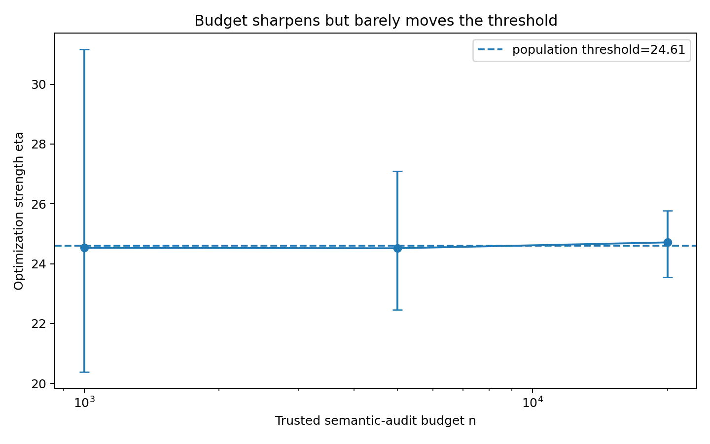
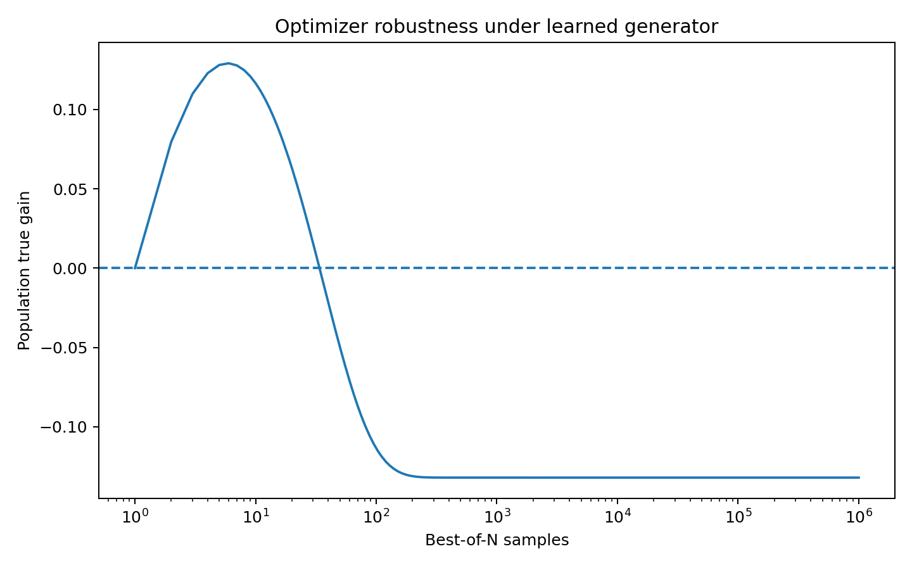
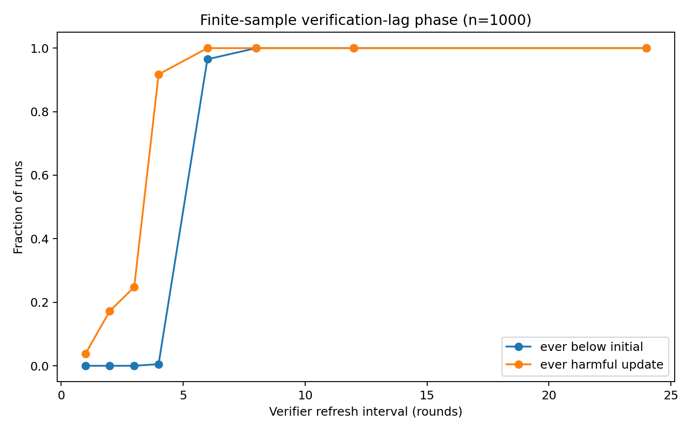
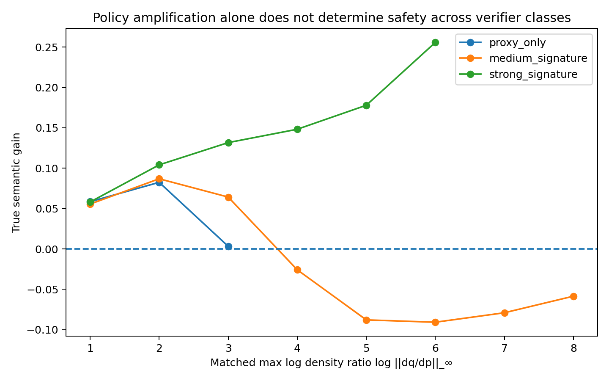

# Experiments

The experiments are designed as **mechanism falsification tests**, not benchmark competitions.

## A. Finite non-Gaussian misspecification

- 401-point outcome space.
- Asymmetric discrete-Laplace base policy.
- Bounded nonlinear true reward.
- Actually fitted misspecified linear verifier.
- Stochastic trusted labels.

Main result:

- population true-gain crossing `eta* ~= 3.4975`;
- threshold center remains nearly fixed across large changes in audit budget;
- transition width scales approximately `n^-0.515`.

## B. Finite-domain program synthesis

Input domain:

```text
x in {0,...,255}
```

True target:

```python
def target(x):
    return (x*x + 3*x + 7) % 11
```

The candidate pool contains regular approximate programs, public-test-memorizing exploit programs, and rare exact programs. The learned verifier uses public-test pass rate as its feature while true reward is exhaustive semantic correctness.

Main result:

- population crossing `eta* ~= 24.6083`;
- 100x audit-budget change moves the 50% wrong threshold by less than 1%;
- transition width scales approximately `n^-0.525`.



## C. Learned autoregressive DSL generator

A small GRU language model is trained over a grammar-constrained program DSL. It induces the base candidate distribution.

A first version **did not fail**: high-proxy regular programs were still genuinely good. This negative result established that merely having exploit programs in support is insufficient.

A stress-test version places public-test-memorizing programs on the proxy frontier.

Main result:

- population crossing `eta* ~= 22.5409`;
- width scales approximately `n^-0.531`;
- adding an exploit-representing verifier feature removes the population failure in the tested range.

## D. Best-of-N optimizer control

Using the same learned generator and proxy ranking:

- true performance peaks around `N=6`;
- the first harmful `N` is around `34`.

This shows the rise-then-fall mechanism is not unique to exponential/KL reweighting.



## E. Representation × budget

Trusted sample budget and verifier representation are varied independently.

- More samples primarily sharpen estimation uncertainty inside a fixed misspecified class.
- A richer verifier representation can move or remove the semantic failure boundary.

Working summary:

> **Budget changes width; representation changes center.**


## F. Recursive refresh cadence

Repeated updates are run with different verifier refresh intervals.

With the verifier permanently sealed, the learned-generator environment eventually degrades below baseline. With current-policy refitting every round, the verifier slope shrinks as exploit mass grows and the process self-corrects.

At finite sample size, the probability of falling below baseline shows a sharp transition as the refresh interval increases.



## G. Two-dimensional recursive phase

Per-step optimization strength and refresh interval are varied independently.

Within a fixed score calibration, failure approximately collapses under stale exposure `eta * L`. A later rescaling experiment shows that raw `eta * L` is not invariant to score units.


## H. Invariance tests

The project then tests possible cross-system coordinates.

- Raw `eta * L` fails score-rescaling invariance.
- Max log-density ratio transfers very well between exponential tilt and Best-of-N under the same verifier.
- Matching KL or max density-ratio across different verifier representations does **not** align semantic safety.

Conclusion:

> Policy-shift magnitude alone is insufficient. Shift must be interpreted relative to verifier-error geometry.



## I. Composed-block verification hardness

For a stale exponential block, verification hardness is analyzed as

\[
h(\Lambda)=\frac{V(\Lambda)}{\Delta(\Lambda)^2}.
\]

Current-policy coverage mismatch grows with stale movement, but the statistically dominant blow-up occurs near the point where the true gain approaches zero.

A balanced fresh audit keeps the raw full-class coverage coefficient bounded, but it cannot remove the fundamental `1 / Delta^2` small-margin cost.


