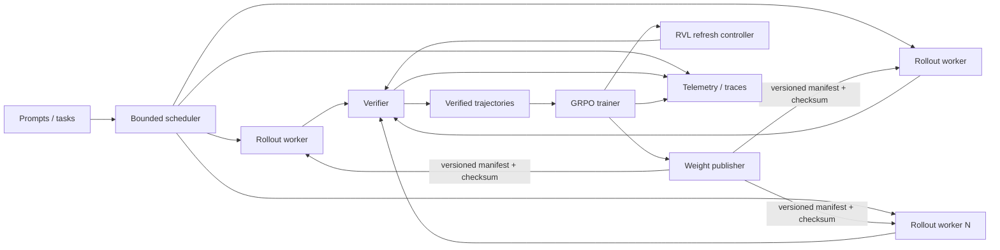

# RL Systems Architecture

This document describes the implementation boundary between the RVL research
question and the post-training systems stack used to test it.

## Control plane

- `rollout.py`: bounded-concurrency request execution.
- `scheduler.py`: least-loaded worker selection, queue bounds, backpressure,
  timeouts, and health-aware routing.
- `worker_health.py`: failure streaks, quarantine, and recovery.
- `worker_rpc.py`: real TCP worker transport with request IDs and explicit
  policy versions.
- `worker_pool.py`: retry/backoff and stale-result validation.
- `weight_sync.py`: immutable weight artifacts, SHA-256 manifests, and worker
  acknowledgement state.
- `checkpoint.py`: atomic checkpoint semantics for the reference trainable
  backend.

## Model / RL data plane

- `hf_backend.py`: local Hugging Face rollout with generated token IDs and old
  token log-probabilities; CUDA/MPS/CPU device selection.
- `backends.py`: toy reference backend and OpenAI-compatible vLLM/SGLang
  serving adapter.
- `verifier.py`: deterministic and functional reward interfaces.
- `grpo.py`, `objectives.py`, `hf_trainer.py`: grouped reward advantages,
  clipped surrogate objectives, and token-level causal-LM update path.
- `precision.py`, `numerics.py`: low-precision policy and numerical safety
  diagnostics.

## Distributed execution

`torch_distributed.py` provides explicit process-group lifecycle, parameter
broadcast, and all-reduce helpers. The real CI path launches two processes with
`torchrun`, executes DDP backward/optimizer synchronization, and verifies
parameter equality across ranks. This validates distributed correctness on
CPU/Gloo; it is not a substitute for NCCL/FSDP GPU measurements.

## Evidence and profiling

- `telemetry.py`: counters and p50/p95/max summaries.
- `profiling.py`: Chrome trace-compatible spans.
- `benchmark_report.py`: machine-readable benchmark schema with environment,
  git revision, model, config, and metrics.
- `benchmark_rollout_engine.py`: sync-vs-async reference benchmark.
- `benchmark_scheduler.py`: multi-worker scheduler benchmark.
- `benchmark_vllm_cluster.py`: real multi-endpoint serving benchmark harness.

CI retains benchmark JSON as workflow artifacts. GPU experiments should use
the same report schema so comparisons are derived from raw outputs rather than
hand-entered headline numbers.

## Scale boundary

The control plane is intentionally usable without a GPU. The next evidence
boundary is empirical rather than architectural: pinned vLLM/SGLang GPU runs,
held-out Qwen RLVR training/evaluation, weight-sync overhead, and NCCL/FSDP
multi-GPU profiling. See `docs/xai_evidence_matrix.md` and issues #10-#12.
