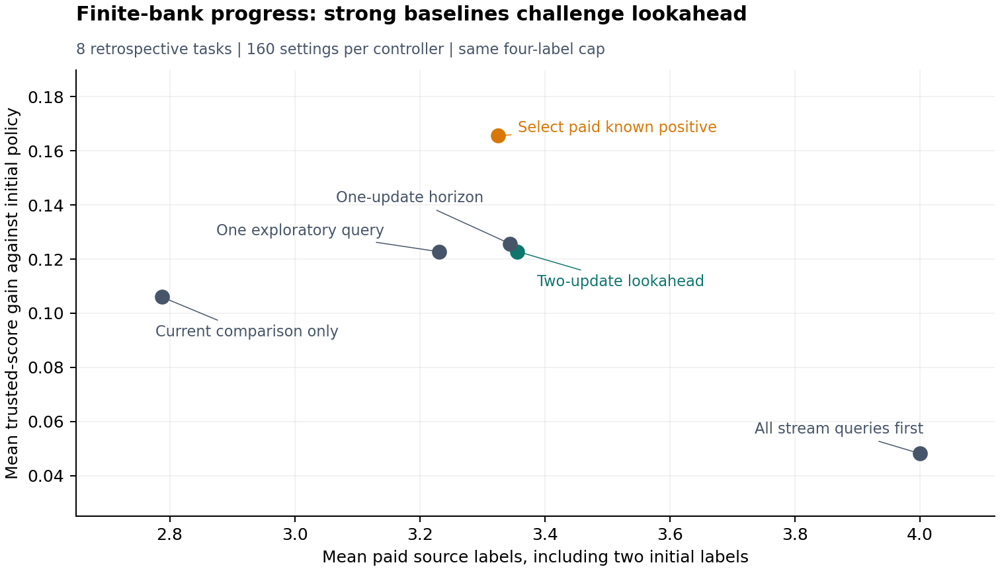

# Progress 35 — An exploration trap and a stronger baseline change the study

The completed retrospective study uses the same previously observed eight
MBPP+ tasks. It cannot serve as independent validation. Its new contribution
is a mechanism test: optimizing the cost of a current decision can prevent
collecting the information needed to generate a better next proposal.

## Completed theory and experiment

All-zero paid labels imply an all-zero ridge verifier. Soft tilting and
tie-preserving best-of-N return the baseline; a positive-floor gate rejects
the already resolved identity comparison, so current-only acquisition stops.
An explicit three-source example separates this controller from one proactive
query. The result is architecture-specific and elementary, with established
dual-control and active-reward-learning antecedents.

`src/endogenous_audit.py` adds an exact reference for stop/query/refit/certified
update actions, with a declared independent binary prior and finite resource
caps. It does not read an unqueried outcome. Exhaustive binary completions
verify safety, exact paid cost, Bellman versus realized prior value, and
agreement with an independently enumerated action-tree reference.

Two-update, two-additional-label comparisons retain all eight tasks and 160
settings per controller. Exact .5-prior lookahead increases mean gain from
.105999 to .122825 but raises mean paid labels from 2.7875 to 3.35625. Its
descriptive task-bootstrap gain interval against myopic crosses zero. A single
forced stream query when paid labels are all zero reaches .122718 with 3.23125
labels, explaining 99.36% of the mean lookahead gain difference. Replanning
one update at a time reaches .125735. Long-horizon complexity is unsupported.

The essential additional control is direct paid-known-positive selection:
it reaches .165625 gain at 3.325 labels, better mean gain and lower mean cost
than the primary lookahead. The source-box lower bound of baseline conditioned
on known positives equals baseline mass on known negatives. When this exceeds
the .01 floor the policy is certified and its trusted reward is one, the
finite-bank maximum. Fitted-policy planning optimality never covered this
different action family. All rows, paid transcripts, task tables, contrasts,
code hashes and output hashes are archived, including zero-success tasks.

Theory and complete caveats: `notes/theory/endogenous_information_and_progress.md`.
The plot shows correlated-setting means; uncertainty is in the paired
task-bootstrap tables, not implied by the point geometry.



Reproduce:

```sh
python -m src.evaluate_endogenous_audit data/mbppplus_qwen15b_pilot_v1_scored.jsonl --output results/endogenous_reproduction
python -m src.plot_endogenous_audit results/endogenous_reproduction/summary.csv --output figures/endogenous_reproduction
```

## Next endpoint is transfer, not selecting an already verified answer

While development generation is still in progress and no development scored
artifact has been inspected, `configs/fresh_task_verifier_transfer_v1.json`
locks the first 16 development-manifest task IDs for training and the next
16 for evaluation. This is a new pre-outcome development analysis, not the
original confirmatory heldout split. No heldout task is generated or queried.

On each training task a fixed source stream supplies two initial and up to two
additional labels. The frozen verifier makes every evaluation-task decision
before the additional training labels are released; the refreshed verifier
makes its decisions afterwards. Source identities and total source-label ledger
costs are identical. These are replayed oracle costs on a fully scored bank;
physical data production separately scores 512 model occurrences and validates
32 reference programs. The 256 evaluation-task occurrences are reported apart
from training label use, and stored generation-token positions include EOS
padding rather than pretending to be API billing tokens.
Tasks with fewer than four unique texts retain their identity
and report lower actual cost; there is no task replacement. Both verifiers
receive zero trusted labels from the 16 evaluation tasks. Evaluation outcome
reads begin only after all frozen and refreshed policies exist.

The primary endpoint is refreshed-minus-frozen expected trusted pass probability
on these 16 fresh tasks after four soft updates (eta=1, all cheap features,
ridge=1e-4). Uniform occurrence weighting and public-score selection are
controls. Public-only representations, best-of-N=4, and one/twelve-update
results are declared secondary. All zero-success tasks remain included;
task-bootstrap intervals are descriptive. No choosing the best variant after
seeing outcomes. Model/dataset/split/scored-bank provenance must match or the
analysis aborts. Learning remains linear-verifier fitting and selection from a
fixed generator; no generator parameter update or capability-creation claim.

`src/fresh_task_transfer.py` implements the lock. The separate
`rvl-fresh-task-transfer` workflow awaits development run 37389940505 at SHA
1a45ba6a6967d00ba7869a956f59c9cc01ed4bb8, requires successful completion,
downloads only its full record, checks provenance, and publishes analysis
artifacts. It does not cancel or restart generation. A failed or partial
generation/scoring run produces no transfer conclusion. Running/queued
workflows remain **pending evidence**, not a result.

```sh
python -m src.fresh_task_transfer data/mbppplus_qwen15b_development_v2_scored.jsonl --output results/fresh_task_transfer_reproduction
```

This is a stronger reviewable research increment, not a certificate of
frontier-lab readiness. A positive development transfer would justify a
separately frozen confirmatory study. A negative result must be kept and
cannot be rescued by opening heldout outcomes or claiming fixed-bank gains
were learned self-improvement.
