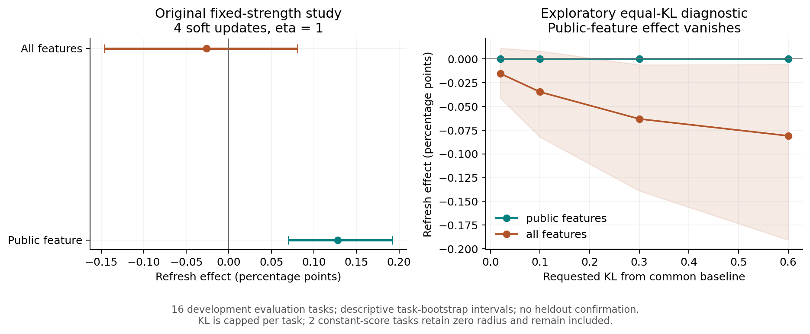

# Progress 37 — Scale changes do not establish better verifier transfer

Recorded 2026-10-07 (Asia/Tokyo). The exploratory protocol was committed at
`8d4115c` after seeing the original transfer summaries and before executing this
diagnostic. It is not a pre-outcome confirmatory study. The original primary
endpoint, data, labels and task partition remain intact.

## Executed diagnosis

The public-only ridge slope changes from 0.81248984 to 0.82707735. Both are
positive. An intercept cancels from an exponential tilt, so both score vectors
trace the exact same policy path as the raw public-score feature. Matching KL
from the common baseline removes the apparent soft-update refresh benefit:
frozen, refreshed and raw public-score policies are equal at all four requested
budgets (0.02, 0.1, 0.3, 0.6). Their trusted reward differences are numerically
zero. This is an algebraic identification, not a significance test.

For the all-feature fit, refreshed-minus-frozen differences are -0.00015352,
-0.00034734, -0.00063173, -0.00080962 across those budgets. All-feature refreshed
also underperforms raw public score at each budget. No best variant is selected.
The bootstrap intervals and all per-task rows are retained; they are descriptive,
correlated comparisons on 16 development evaluation tasks, not a new primary
claim. The common target is capped at half the smallest attainable limiting KL
among five arms per task. Two constant-public-score tasks retain a zero common
radius; they are included, not discarded. Actual KL is saved for every policy.

Both representations have **zero** pairwise order/tie changes on all 1,920
within-task sample-occurrence pairs. Best-of-N is therefore unchanged across
refresh, as observed in the original run. Non-affine spacing can still differ;
the all-feature result is not explained solely by scalar calibration.

A single fixed within-training-task shuffled-label control is archived. It
preserves label counts and task-level prevalence. Its own attainable KL radius
is reported separately; it is not one of the common-radius matched comparisons,
and one permutation is not a permutation null distribution.



## Safety and theory

`notes/theory/transfer_calibration_and_no_label_limits.md` proves the elementary
positive-affine path identity, KL monotonicity, rank-only best-of-N invariance,
and the sharp unpaid-task box bound. Without evaluation labels or a valid
cross-task reward assumption, any nonidentity source-mass update can be harmful
in a reward world compatible with the training transcript. Empirical average
transfer and per-task safety certification must remain separate claims.

## Reproduction and validation

```sh
python -m src.transfer_calibration data/mbppplus_qwen15b_development_v2_scored.jsonl --output results/transfer_calibration_reproduction
python -m src.plot_transfer_calibration
python -m unittest tests.test_transfer_calibration -v
```

The complete output directory is `results/transfer_calibration_v1/`: 384 task/arm/
budget rows, full policies and score vectors, original-fit reproduction, ranking
relations, comparisons, models, and SHA-256 lineage. Complete decisions are
persisted before new evaluation-outcome reads. There are zero new physical
candidate executions, zero evaluation-task decision-time queries and zero
generator parameter updates.

Six focused tests pass: random nonuniform-support affine invariance and KL
constraints; tied maxima/constants/invalid inputs; negative-slope and tie
counterexamples; label-blocked construction and zero-radius retention; exhaustive
binary-world safety bounds; full archive-based integration and provenance abort.
The full research suite passes 78 tests and the existing phase-frontier analysis
passes. New GPU evidence and independent heldout confirmation remain open.

## Research decision

Do not promote the secondary public-only effect into a learned error-correction
claim. More labels alone and more cheap features did not improve this locked
transfer study. The next useful measured increment is real model training with
independent evaluation and strong no-update/public-score controls, or a narrowly
specified timing predictor validated on development before opening heldout data.
